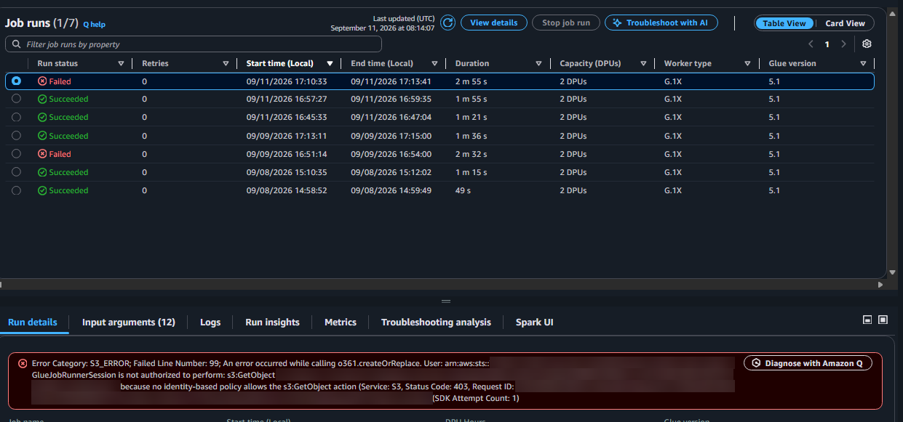

# Lab4: AWS Glue PySpark와 Iceberg Silver·Gold

AWS Glue의 PySpark 작업으로 Bronze 주문을 정제해 Iceberg Silver를 만들고, 고객·상품·일별 Gold 테이블을 생성했습니다. Athena에서는 각 계층의 결과를 독립적으로 비교하고 동일 입력 재실행 결과까지 확인했습니다.

## 처리 흐름

```text
S3 Bronze
  → AWS Glue PySpark
  → Iceberg Silver
  → Customer·Product·Daily Gold
  → Athena 정합성 검증
```

- `customer_id`가 없거나 금액이 0 이하인 행 제거
- `order_id` 기준 중복 제거
- 날짜·연도·월·주차 파생 컬럼 생성
- 고객·상품·일별 분석 단위의 Gold 생성
- Iceberg format-version 2로 저장
- Silver와 Gold 사이의 누락·추가 행, 주문 수와 매출 값 비교
- 동일 입력 재실행 후 결과 유지 확인

## 핵심 코드

[glue/silver_transform.py](glue/silver_transform.py)는 정제와 세 가지 Gold 집계를 한 작업에서 수행합니다.

```python
silver_df = (
    bronze_df
    .filter(col("customer_id").isNotNull())
    .filter(col("amount") > 0)
    .dropDuplicates(["order_id"])
    .withColumn("order_date", to_date("order_timestamp"))
)
```

Spark는 변환과 저장을 담당하고, Athena는 생성된 Iceberg 테이블을 SQL로 다시 검증합니다.

## 검증 결과

- Silver의 주문 ID 고유 비율 100%
- 날짜 파생 컬럼의 NULL 및 계산 불일치 0건
- 상품 Gold와 Silver의 주문 수·매출 합계 일치
- 일별 Gold 전 범위에서 누락·추가 행 및 주문·매출 값 불일치 0건
- 동일 입력 재실행 후 결과 유지

절대 데이터 규모보다 정제 규칙의 일관성, 계층 간 전체 대조와 재실행 가능성을 검증하는 데 초점을 맞췄습니다. 공개 가능한 근거는 [evidence/README.md](evidence/README.md)에 정리했습니다.

## 권한 오류와 해결

Gold 테이블을 `createOrReplace()`로 저장할 때 기존 Iceberg 메타데이터를 읽는 객체 권한이 부족해 작업이 실패했습니다. 실패 경로와 필요한 객체 작업을 확인해 권한 범위를 해당 테이블 경로로 제한해 보완했습니다. 이후 전체 작업과 Athena 대조가 성공했습니다.



계정 ID, 역할, S3 경로와 요청 ID는 가린 화면입니다. 실패 후 권한을 보완해 같은 작업을 다시 실행했습니다.

공개용 권한 예시는 [iam/GlueLab4IcebergS3Access.example.json](iam/GlueLab4IcebergS3Access.example.json)에 있습니다.

## 실행 파일

| 파일 | 역할 |
| --- | --- |
| [glue/silver_transform.py](glue/silver_transform.py) | Bronze 정제와 Silver·Gold 생성 |
| [glue/job_parameters.example.json](glue/job_parameters.example.json) | Glue Job 설정 예시 |
| [sql/01_preflight.sql](sql/01_preflight.sql) | 입력 테이블과 품질 사전 확인 |
| [sql/02_existing_silver_validation.sql](sql/02_existing_silver_validation.sql) | 기존 Silver 기준 확인 |
| [sql/03_validate_lab4_silver.sql](sql/03_validate_lab4_silver.sql) | 별도 Silver 결과 대조 |
| [evidence/README.md](evidence/README.md) | 공개용 검증 근거 요약 |

기준일과 Snapshot ID는 실제 입력을 확인한 뒤 고정해야 합니다. 실제 AWS 설정과 원본 실행 화면은 공개 파일과 분리했습니다.
