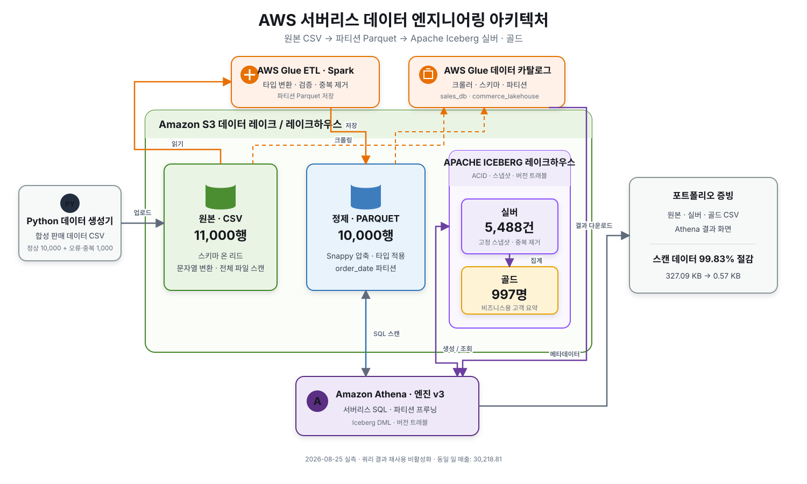
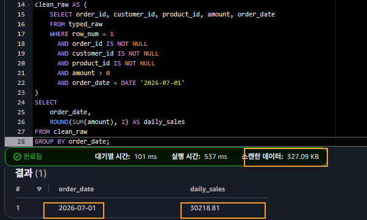
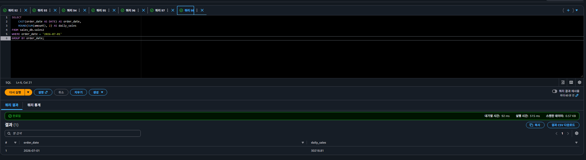
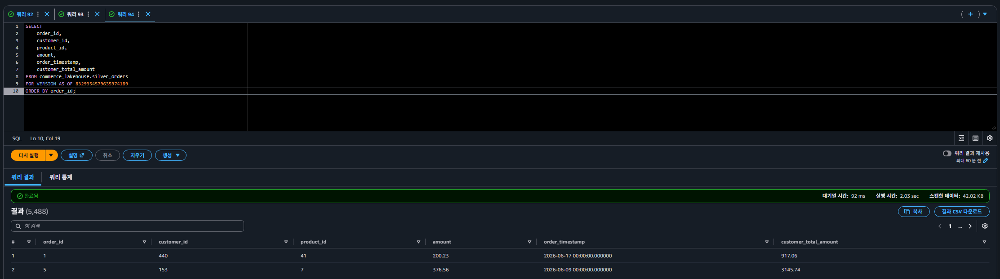
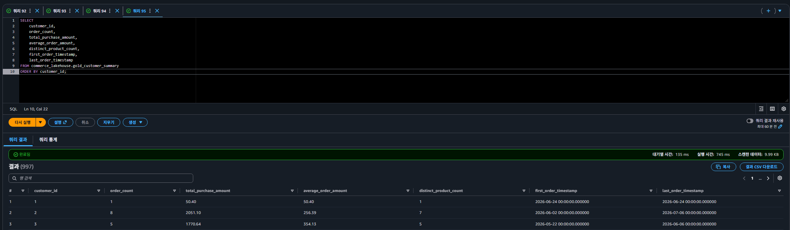

# AWS Sales Data Engineering Portfolio

**정홍섭** · 개인 학습 프로젝트(학습·포트폴리오용) · 2026.07 ~ 2026.09  
Python · Pandas · SQL · PySpark · Amazon S3 · AWS Glue · Amazon Athena · Apache Iceberg

학습용으로 생성한 판매 데이터를 이용해 데이터 생성·품질 검사부터 AWS 기반 ETL, SQL 검증, Apache Iceberg Lakehouse까지 구현한 개인 프로젝트입니다.

이 저장소는 작업 순서를 나열하기보다 다음 역량을 코드와 검증 근거로 보여주는 데 목적이 있습니다.

- Python·Pandas 데이터 생성과 품질 검사
- Amazon S3·AWS Glue·Athena 기반 서버리스 데이터 파이프라인
- CSV에서 Parquet으로의 변환과 날짜 기준 파티셔닝
- Bronze·Silver·Gold 계층과 Apache Iceberg Snapshot 관리
- PySpark 집계 결과와 Athena SQL 결과의 교차 검증
- 동일 입력 재실행과 과거 Snapshot 복원을 통한 재현성 확인

## 전체 데이터 흐름



```text
Lab1  Python·Pandas → S3 Raw → Glue Data Catalog → Athena
Lab2  S3 Raw → Glue ETL → S3 Curated Parquet → Athena
Lab3  S3 Bronze → Iceberg Silver → Customer Gold → Athena
Lab4  S3 Bronze → Glue PySpark → Iceberg Silver
                                 → Customer·Product·Daily Gold → Athena 검증
```

Lab2에서는 Raw CSV를 Curated Parquet으로 변환했습니다. Lab3~4에서는 Bronze 원본을 공통 품질 기준으로 정제한 Silver와 분석 목적별 Gold로 확장했습니다.

## Lab별 발전 과정

| Lab | 핵심 주제 | 구현 내용 | 검증 관점 |
| --- | --- | --- | --- |
| [Lab1](Lab1/README.md) | 조회 가능한 Data Lake | 데이터 생성·검사, S3 적재, Catalog 등록, Athena 분석 | 입력 품질과 SQL 결과 확인 |
| [Lab2](Lab2/README.md) | ETL과 저장 최적화 | 오류 데이터 정제, Decimal 변환, Parquet·날짜 파티션 | Raw·Curated 양방향 대조와 스캔량 비교 |
| [Lab3](Lab3/README.md) | Iceberg Lakehouse | Bronze·Silver·Gold, ACID 변경, Snapshot·Schema Evolution | 기준일과 Snapshot을 고정한 결과 복원 |
| [Lab4](Lab4/README.md) | PySpark 계층 확장 | Silver와 고객·상품·일별 Gold 생성 | 계층 간 전체 대조와 동일 입력 재실행 |

## 주요 문제 해결 사례

### 같은 결과를 기준으로 저장 형식의 효과 비교

CSV와 날짜 기준으로 파티셔닝한 Parquet에서 동일한 일 매출 결과가 나오는 조건으로 비교했습니다. 작은 학습 데이터에서는 실행 시간 차이가 크지 않았지만 Athena 스캔량은 약 99.83% 감소했습니다. 처리 시간과 스캔량을 분리해 해석했습니다.

### 실행일 의존성을 고정 기준일과 Snapshot으로 보완

Lab3에서 최근 90일 조건의 기준을 `CURRENT_TIMESTAMP`로 두었더니, 다시 적재한 Silver가 5,488건에서 5,246건으로 줄었습니다. 오류 없이 결과만 달라진 경우였습니다. 실행일을 기준으로 미래 데이터를 제거하는 조건도 같은 이유로 재실행 시 결과가 달라질 수 있습니다. 이후 기준일(`2026-08-18`)과 Iceberg Snapshot을 함께 고정하고, `FOR VERSION AS OF` 결과로 Silver 5,488건을 다시 구성한 뒤 Gold 고객 요약 997건을 재생성해 결과를 대조했습니다.

### Spark 결과를 Athena에서 독립적으로 검증

Glue Job의 성공 여부만으로 정확성을 판단하지 않았습니다. Silver와 각 Gold 사이의 누락·추가 행, 주문 수, 매출 값을 Athena SQL로 비교했고 동일 입력 재실행 후에도 같은 결과가 유지되는지 확인했습니다.

### Iceberg 메타데이터 접근 권한 오류 해결

Iceberg 테이블 교체 과정에서 기존 메타데이터를 읽는 객체 권한이 부족해 작업이 실패했습니다. 실패 경로와 필요한 객체 작업을 확인해 해당 테이블 경로의 권한만 보완한 뒤 전체 작업과 Athena 검증을 다시 완료했습니다.

## 주요 검증 결과



CSV 스캔량 327.09 KB · 2026-07-01 매출 30218.81



CSV 327.09 KB → Parquet 0.57 KB · 동일 날짜(2026-07-01)·동일 매출(30218.81)

※ Lab2·Lab3 화면은 필요한 부분만 잘라 재배치했으며, 수치는 원본 Athena 화면과 같습니다.

동일한 분석 결과를 기준으로 저장 형식과 날짜 파티션 적용 전후의 Athena 스캔량을 비교했습니다.



Snapshot 8329354579635974189 조회 · Silver 결과 5,488행



고객별 Gold 집계 결과 997행

정제된 Silver와 분석용 Gold를 Athena에서 각각 조회해 계층별 결과를 확인했습니다. 세부 SQL과 추가 증빙은 각 Lab README에서 확인할 수 있습니다.

## 저장소 구조

```text
.
├── Lab1/              # 데이터 생성·검사와 Athena 분석
├── Lab2/              # Glue ETL, Parquet·Partition, 정합성 비교
├── Lab3/              # Iceberg DDL·Snapshot·복원 SQL
├── Lab4/              # PySpark Silver·Gold와 Athena 검증
├── docs/architecture/ # 아키텍처 다이어그램
├── SECURITY.md
└── README.md
```

## 실행 전 준비

- Python 3.11 이상
- AWS 계정과 S3·Glue·Athena 사용 권한
- Athena Engine version 3
- 프로젝트용 S3 버킷과 Athena Query Result 경로

저장소의 `<YOUR-BUCKET>`과 `<YOUR-GLUE-ROLE>`은 자신의 환경 값으로 바꿔야 합니다. 실제 자격 증명, 계정 ID, 역할 ARN, 실행 요청 ID는 포함하지 않습니다.

## 재현 순서

1. [Lab1 README](Lab1/README.md)에 따라 판매 데이터를 생성하고 품질을 검사합니다.
2. Lab1 SQL로 S3 데이터를 Catalog에 등록하고 Athena 분석 결과를 확인합니다.
3. [Lab2 README](Lab2/README.md)에 따라 오류 데이터를 생성하고 Glue ETL과 Raw·Curated 대조를 수행합니다.
4. [Lab3 README](Lab3/README.md)의 SQL 순서로 Iceberg 계층과 Snapshot 복원을 확인합니다.
5. [Lab4 README](Lab4/README.md)에 따라 PySpark 작업을 실행하고 Silver·Gold 전체 정합성과 재실행 결과를 검증합니다.

AWS 리소스 생성과 쿼리 실행에는 비용이 발생할 수 있습니다. 기존 Snapshot을 제거하는 작업은 복원 가능성을 없앨 수 있으므로 검증이 끝나기 전에는 실행하지 않습니다.

## 프로젝트 한계와 확장 방향

- 학습용 생성 데이터를 사용했으므로 대용량 운영 성능을 증명하는 프로젝트는 아닙니다.
- 데이터 규모가 작아 파티션 적용 여부는 실제 조회 패턴과 파일 크기에 맞춰 다시 판단해야 합니다.
- 동일 주문 ID에 서로 다른 값이 들어오는 경우의 우선순위 규칙은 운영 정책으로 추가 설계가 필요합니다.
- 향후 실제 수집 데이터, 증분 처리, 자동 품질 검사와 배포 자동화로 확장할 수 있습니다.
